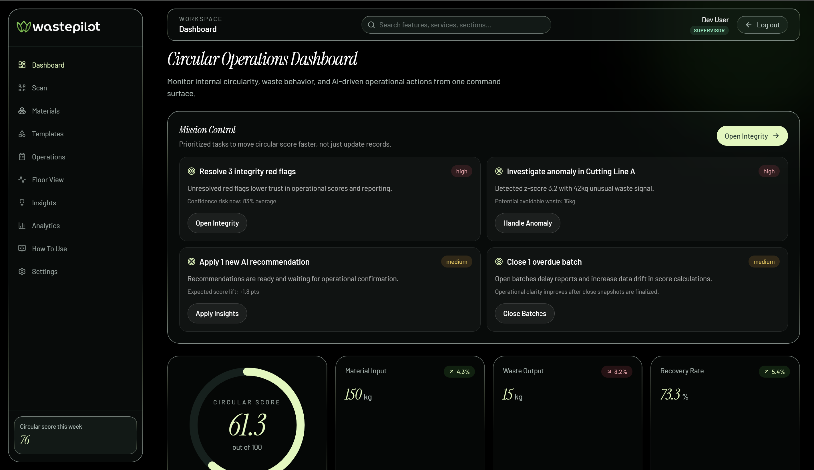
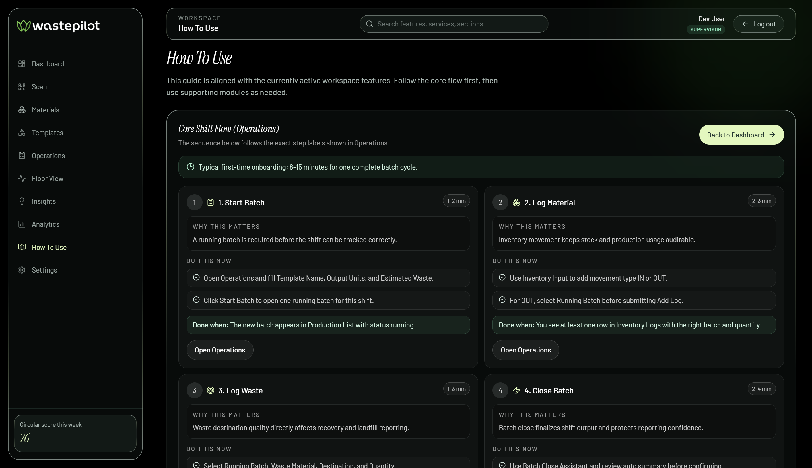
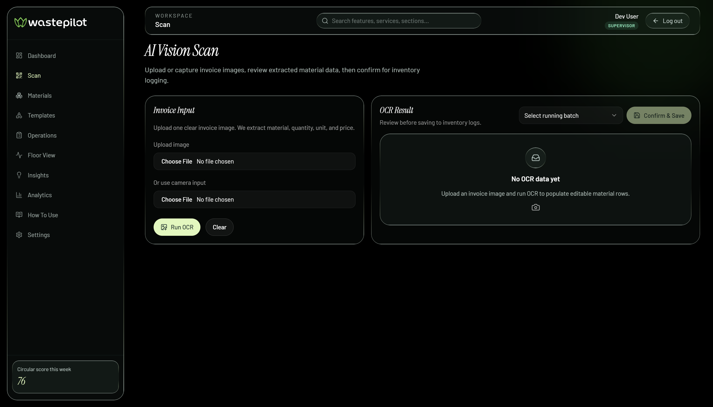
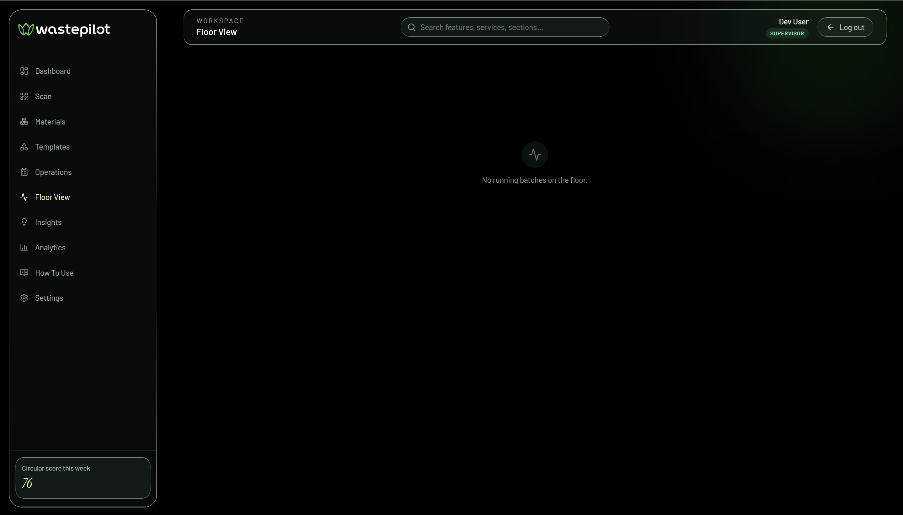
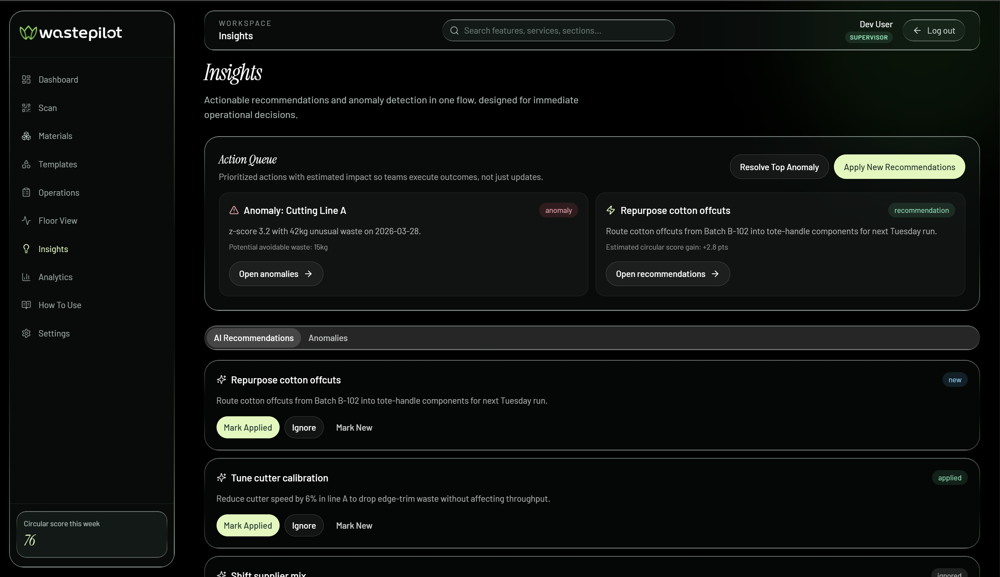
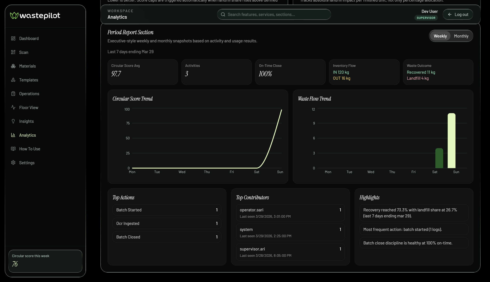
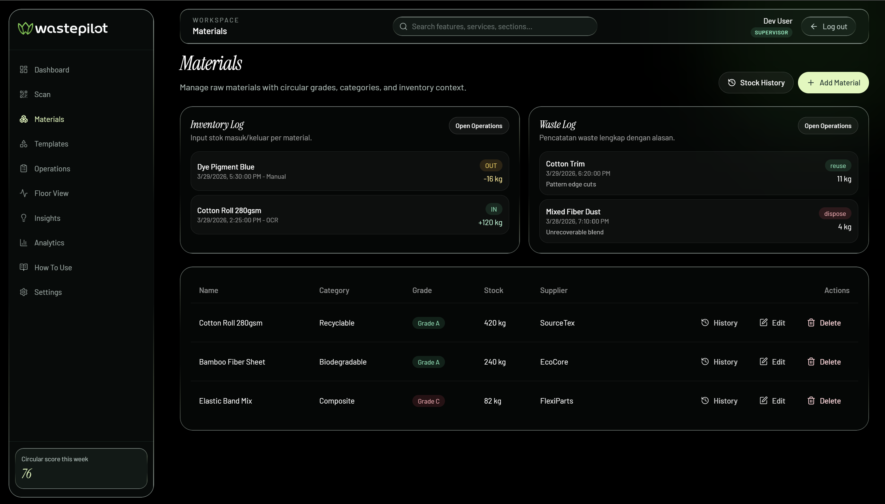
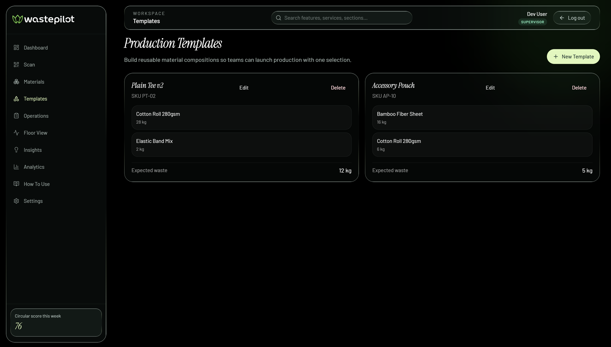

<div align="center">

# WastePilot

### Smart Circular Economy Platform for Manufacturing
#### *Turning Waste Data Into Trustworthy Decisions*

<br/>

[](https://waste-pilot.vercel.app/)
[](https://github.com/Harvlin/WastePilot)
[](https://github.com/Harvlin/WastePilot/actions)
[](LICENSE)

<br/>

> **Submission for ITECHNO CUP 2026, Web Development**
> **Tema: SDG 9 — Industri, Inovasi, dan Infrastruktur**
>
> **By WastePilot Team**

</div>

---

## 📋 Daftar Isi

- [Tentang Proyek](#-tentang-proyek)
- [Fitur Unggulan](#-fitur-unggulan)
- [Arsitektur Integritas Data, Diferensiator Inti](#️-arsitektur-integritas-data-diferensiator-inti)
- [Strategi AI, Transparan dan Proporsional](#-strategi-ai-transparan-dan-proporsional)
- [Demo & Screenshot](#-demo--screenshot)
- [Teknologi](#️-teknologi)
- [Arsitektur Sistem](#️-arsitektur-sistem)
- [Rumus & Perhitungan](#-rumus--perhitungan)
- [Instalasi & Setup](#️-instalasi--setup)
- [Penggunaan](#-penggunaan)
- [API Documentation](#-api-documentation)
- [Testing](#-testing)
- [Keamanan](#-keamanan)
- [Observability & Reliability](#-observability--reliability)
- [Diferensiasi Kompetitif](#-diferensiasi-kompetitif)
- [Model Keberlanjutan Bisnis](#-model-keberlanjutan-bisnis)
- [Kualitas Rekayasa & Proses Pengembangan](#-kualitas-rekayasa--proses-pengembangan)
- [Roadmap](#️-roadmap)
- [Tim Developer](#-tim-developer)
- [Lisensi](#-lisensi)

---

## 👥 Tim Developer

| Nama | Peran | GitHub |
| :--- | :---- | :----: |
| **Harvlin Maximillian** | Project Lead & Full Stack Developer | [GitHub](https://github.com/harvlin) |
| **Kledya Abigail Sinaga** | UI/UX Designer | [GitHub](https://github.com/[username2]) |
| **Jessline Aglecia** | Frontend Developer | [GitHub](https://github.com/[username3]) |

---

## 🎯 Tentang Proyek

### Deskripsi Singkat Ide

WastePilot merupakan media pendamping berbasis platform web yang dibuat untuk membantu proses manufaktur menjadi lebih berkelanjutan melalui penerapan prinsip ekonomi sirkular. Platform ini menggabungkan aktivitas harian yang umumnya tersebar di banyak tools ke dalam satu alur kerja terpandu, mulai dari pembukaan batch, pencatatan material masuk, pencatatan material keluar, klasifikasi limbah, penutupan batch, hingga evaluasi integritas data dan insight perbaikan.

Platform ini berorientasi pada tindakan. Sistem tidak hanya menampilkan data, tetapi juga memberikan arahan tindakan prioritas melalui fitur **Mission Control** dan **Action Queue** agar keputusan operasional dapat dilakukan dengan lebih cepat dan tepat. WastePilot juga membantu meningkatkan integritas pengelolaan data sehingga informasi operasional dapat menjadi dasar pengambilan keputusan yang lebih terpercaya.

### Latar Belakang

Perkembangan tren konsumerisme dari tahun ke tahun mendorong peningkatan aktivitas produksi berbagai jenis barang, mulai dari barang bermerek, kosmetik, hingga produk industri lainnya. Peningkatan kebutuhan dan produksi tersebut turut meningkatkan jumlah material yang digunakan serta limbah yang dihasilkan selama proses manufaktur.

Masalah muncul ketika limbah dan sisa material dari aktivitas produksi tidak dikelola secara disiplin. Minimnya kesadaran ekologis, kurangnya tanggung jawab dalam pengelolaan limbah, serta pencatatan yang belum terstruktur dapat meningkatkan risiko pemborosan sumber daya dan dampak lingkungan. Dalam kondisi tersebut, sistem ekonomi tradisional yang bersifat linear, yaitu mengambil sumber daya, memproduksi barang, lalu membuang sisa material setelah proses produksi, menjadi kurang berkelanjutan.

Sebagai alternatif, **ekonomi sirkular** merupakan pendekatan industri yang menitikberatkan pada pengurangan penggunaan sumber daya alam baru, minimisasi limbah, serta pemanfaatan kembali material selama dan setelah proses produksi. Konsep ini tidak hanya berfokus pada pengelolaan limbah, tetapi juga mendorong integrasi proses produksi agar material dapat digunakan kembali secara berulang dan memiliki nilai yang lebih panjang dalam siklus produksi.

WastePilot hadir untuk membantu mewujudkan penerapan ekonomi sirkular secara lebih nyata dalam aktivitas produksi, khususnya pada proses manufaktur perusahaan UMKM dan industri skala menengah.

### Solusi yang Ditawarkan

WastePilot merupakan platform pendamping operasional circular manufacturing yang mengintegrasikan aktivitas pencatatan dan pengelolaan material ke dalam satu sistem terpusat. Alur kerja dimulai dari **Start Batch → Log Material → Log Waste → Close Batch → Integrity Check**, sehingga proses operasional harian menjadi lebih terstandar dan mudah ditelusuri.

Selain pencatatan, WastePilot menyediakan mekanisme untuk meningkatkan integritas data melalui **Audit Trail, Reason Wajib, Anomaly Detection, Pattern Review, dan Cross-Validation**. Dengan demikian, sistem tidak hanya berfungsi sebagai media penyimpanan data, tetapi juga membantu memastikan bahwa data operasional dapat ditinjau, ditelusuri, dan digunakan sebagai dasar evaluasi.

Pendekatan ini dilengkapi dengan fitur **AI Vision Scan** untuk membantu input material dari invoice, **Live Factory Floor View** untuk memantau batch aktif, serta **Analytics & Insights** untuk memberikan gambaran tren kinerja dan peluang perbaikan. WastePilot juga memiliki fondasi IoT-ready melalui sensor ingestion endpoint dan simulator sensor yang dapat menjadi tahap awal menuju integrasi perangkat fisik di lingkungan produksi.

Dengan ini, platform ini mengintegrasikan pencatatan material, pengelolaan waste, monitoring batch, integritas data, serta analitik ke dalam satu alur kerja operasional yang terpandu.

### Tujuan Proyek

#### 🎯 Tujuan Umum

a. Membangun sistem operasional circular manufacturing yang terpusat, mudah digunakan, dan siap diintegrasikan ke back-end production.

b. Meningkatkan efisiensi operasional dan akurasi data produksi melalui otomatisasi pencatatan, pemantauan batch, serta analisis limbah secara real-time.

c. Mendorong penerapan industri berkelanjutan dengan menekan waste ke landfill, memaksimalkan pemanfaatan ulang material, dan menyediakan indikator kinerja lingkungan yang terukur.

#### 🎯 Tujuan Khusus

a. Menstandarkan proses batch harian dari awal hingga penutupan dengan guardrails yang konsisten.

b. Mempercepat proses input material menggunakan pendekatan OCR-ready dengan fallback saat layanan AI belum aktif.

c. Meningkatkan traceability melalui activity logs, audit trail, dan integrity overview.

d. Menyediakan dasar pengambilan keputusan berbasis data melalui insight dan indikator operasional.

e. Menyediakan evaluasi performa periodik melalui modul analytics dan laporan tren.

### Manfaat

#### 👷 Bagi Operator Produksi

a. Alur kerja harian lebih jelas karena tersedia step-by-step workflow.

b. Risiko kesalahan input berkurang berkat validasi form dan aturan langkah kerja.

c. Pencatatan data menjadi lebih cepat melalui OCR dan template produksi.

#### 👨‍💼 Bagi Manajer Operasional

a. Monitoring batch lebih mudah dengan indikator running, completed, dan overdue.

b. Keputusan dapat dilakukan lebih cepat karena tersedia prioritas tindakan yang langsung dapat dieksekusi.

c. Integritas data lebih terjaga untuk kebutuhan review internal dan handover shift.

#### 🏭 Bagi Perusahaan

a. Transparansi kinerja circularity meningkat melalui dashboard dan periodic analytics.

b. Terdapat efisiensi biaya melalui pengurangan landfill dan optimalisasi recovery material.

c. Tersedia fondasi digital yang siap dikembangkan menuju skala produksi dengan back-end enterprise.

### Nilai Utama WastePilot

WastePilot berfokus pada tiga nilai utama: **operational discipline, data integrity, dan circularity**. Ketiganya diwujudkan melalui alur kerja terpandu, pencatatan dan audit data yang terstruktur, serta pengelolaan material dan limbah yang mendukung pemanfaatan kembali.

Dengan pendekatan tersebut, WastePilot tidak hanya membantu perusahaan mengetahui berapa banyak waste yang dihasilkan, tetapi juga membantu mengidentifikasi kondisi yang perlu ditindaklanjuti dan menjadi dasar untuk meningkatkan efisiensi proses produksi.

### Target Pengguna

WastePilot ditujukan terutama bagi perusahaan manufaktur UMKM hingga skala menengah, khususnya sektor tekstil, garmen, dan produk berbasis material campuran yang membutuhkan sistem pencatatan waste dan material yang lebih terstruktur. Platform dirancang agar dapat digunakan secara bertahap, mulai dari pencatatan operasional manual hingga kesiapan integrasi sensor dan pengembangan smart manufacturing.

### Value Proposition

WastePilot menyatukan workflow operasional, pengelolaan waste, integritas data, dan analitik circular manufacturing dalam satu platform web yang berorientasi pada tindakan. Sistem membantu operator menjalankan proses secara konsisten, membantu supervisor menentukan prioritas tindakan, serta memberikan perusahaan fondasi data yang lebih terpercaya untuk mengevaluasi efisiensi material dan kinerja keberlanjutan.

---

## ✨ Fitur Unggulan

### Fitur Utama

| Fitur | Deskripsi | Keunggulan |
| :---- | :-------- | :--------- |
| **Alur Operasional 5-Langkah** | Start Batch → Log Material → Log Waste → Close Batch → Integrity Check, dipandu step-by-step dengan enforcement aktif. | Tombol/aksi dinonaktifkan sampai prasyarat terpenuhi, bukan sekadar divalidasi setelah submit, mencegah kesalahan operator di lapangan. |
| **Empat Lapis Pertahanan Integritas Data** | Audit Trail + Reason Wajib, Anomaly Detection (Z-Score), Pattern Review (Threshold Gaming Detection), Cross-Validation (manual vs sensor). | Diferensiator inti, mengasumsikan data manusia bisa dimanipulasi dan meresponsnya secara aktif, bukan pasif mencatat. Seluruh empat lapis telah teruji lewat integration test dan unit test. |
| **AI Vision Scan** | Upload invoice → ekstraksi material/qty/unit otomatis via Gemini Vision API dengan JSON schema enforcement. | Satu-satunya fitur "AI" yang genuinely memanggil model AI, dilabeli jujur dan dipisahkan dari fitur rule-based lainnya. |
| **Live Factory Floor View** | Seluruh batch aktif di semua line ditampilkan paralel dengan indikator kesehatan warna + ikon (aksesibel), diperbarui via polling berkala. | Visibilitas real-time lintas-line yang bisa diakses baik Operator maupun Supervisor, bukan cuma dashboard admin. |
| **Sensor Ingestion (IoT-Ready)** | Endpoint `POST /sensors/ingest` dengan validasi bounds, dilengkapi simulator Python yang telah dijalankan dan diuji end-to-end terhadap backend produksi. | Membuktikan arsitektur software-first ini genuinely siap menerima data sensor fisik, bukan janji roadmap kosong, sudah didemonstrasikan berjalan. |
| **RBAC Nyata (Bukan Kosmetik)** | Role `OPERATOR`/`SUPERVISOR` ditanamkan sebagai JWT claim, diberlakukan langsung di layer otorisasi Spring Security. | Operasi sensitif (close batch, resolve red flag, koreksi data, pattern review, cross-validation) hanya bisa diakses role yang tepat, teruji lewat test forbidden/allowed case. |

### Fitur Tambahan

- **Insights Rule-Based** — Rekomendasi eksplisit terprogram (tren landfill share naik, waste disproporsional per material) dengan label jujur `"(Rule-based recommendation)"` di response API, tidak pernah diklaim sebagai AI-generated tanpa dasar.
- **Analytics & Export** — Circularity Trend, Landfill Intensity per unit, perbandingan antar-line/shift/periode, dengan export CSV/PDF (via OpenPDF) untuk pelaporan manajemen.
- **Startup Security Fail-Fast** — Aplikasi menolak start di profile produksi jika `JWT_SECRET` masih menggunakan nilai default pengembangan, mencegah deployment dengan celah keamanan yang diketahui publik. Teruji dengan verifikasi bahwa profile lokal tetap berjalan normal.
- **Password Reset Flow** — Alur lupa password standar dengan token sekali pakai.
- **Maturity Level Indicator** — Menunjukkan posisi pabrik dalam jalur adopsi IoT (manual → sebagian sensor → sensor penuh) dengan langkah konkret untuk naik level.
- **Demo Reset & Seed Data** — Mekanisme reset ke kondisi data demo yang konsisten, memastikan presentasi berjalan mulus dengan skenario yang sudah direhearsal.
- **Resilience Fallback Mode** — Frontend selalu mencoba backend asli terlebih dahulu; hanya beralih ke mode mock untuk pembacaan non-kritikal jika terjadi kegagalan sementara, dengan indikator visual yang jelas dan tidak pernah diam-diam.

---

## 🛡️ Arsitektur Integritas Data, Diferensiator Inti

Ini adalah bagian yang paling membedakan WastePilot dari kompetitor sekelasnya. Alih-alih mempercayai satu mekanisme input, sistem melapisi empat pertahanan independen, seluruhnya telah diimplementasikan, diuji, dan diverifikasi:

| Lapisan | Fungsi | Parameter Teknis | Status |
| :------ | :----- | :--------------- | :----: |
| **1. Audit Trail + Reason Wajib** | Akuntabilitas forensik pasca-kejadian, setiap koreksi data memerlukan alasan tertulis | Minimum 10 karakter, kolom `reason` khusus, endpoint koreksi RBAC-gated (`PATCH /operations/batches/{id}/output-units`) | ✅ Selesai & teruji |
| **2. Anomaly Detection (Z-Score)** | Deteksi dini sebelum batch ditutup, lonjakan waste tidak wajar terdeteksi otomatis | Z-score > 2.5, baseline rolling 30 hari per material/line, trigger otomatis saat waste log dibuat | ✅ Selesai & teruji |
| **3. Pattern Review (Threshold Gaming Detection)** | Deteksi pola tersembunyi lintas-waktu, operator yang variance-nya konsisten mepet di bawah ambang wajib-alasan | Window 20 batch terbaru, floor sample 5 batch, band 0.5 poin persentase, ambang kecurigaan 60% | ✅ Selesai & teruji |
| **4. Cross-Validation** | Pencegahan via sumber data independen, begitu sensor terpasang, manusia bukan lagi satu-satunya sumber kebenaran | Tolerance 15%, hanya aktif jika kedua sumber (manual & sensor) tersedia untuk batch-material yang sama | ✅ Selesai & teruji |

Seluruh sinyal dari lapisan 2–4 disajikan dengan **framing netral** ("perlu ditinjau", bukan "terbukti curang"), sebuah keputusan etis yang disengaja, mengingat sinyal statistik pada sampel kecil membawa risiko false positive nyata. Ini bukan hanya prinsip desain di atas kertas, telah diverifikasi langsung ke dalam teks pesan aktual di kode dan direview ulang untuk memastikan tidak ada framing yang menuduh di manapun dalam sistem.

---

## 🤖 Strategi AI, Transparan dan Proporsional

WastePilot membedakan secara eksplisit tiga jenis "kecerdasan" dalam sistemnya, dan tidak pernah mengaburkan batasnya, sebuah keputusan desain yang sengaja diambil untuk menghindari overclaim yang mudah dibantah evaluator teknikal:

| Jenis | Fitur | Cara Kerja |
| :---- | :---- | :--------- |
| **Genuinely AI (LLM)** | AI Vision Scan | Panggilan nyata ke Gemini Vision API dengan JSON schema enforcement, error handling lengkap untuk kegagalan auth/rate-limit/timeout |
| **Statistik murni** | Anomaly Detection, Pattern Review, Cross-Validation | Kalkulasi riil dari data historis/berpasangan, tanpa model AI sama sekali |
| **Rule-based** | Insights/Recommendations | Aturan eksplisit terprogram, dilabeli sebagai `"(Rule-based recommendation)"` langsung di response API |

Pendekatan ini menunjukkan bahwa tim memahami perbedaan mendasar antara ketiga pendekatan tersebut, sesuatu yang sering diabaikan produk kompetitor yang melabeli segala sesuatu sebagai "AI-powered" tanpa dasar teknis yang jelas.

---

## 📸 Demo & Screenshot

### Live Demo

🔗 **[Kunjungi Website](https://waste-pilot.vercel.app/)**

Backend telah dideploy publik dan terhubung penuh, **tidak ada indikator fallback mock aktif** dalam kondisi operasional normal. Seluruh secret produksi (`JWT_SECRET`, `GEMINI_API_KEY`) dikonfigurasi eksplisit sesuai fail-fast validator, bukan bergantung pada nilai default pengembangan.

### Screenshot Aplikasi

<div align="center">
  
  <p><em>Dashboard — Circular Score, Mission Control, Live Factory Floor View, dan Anomaly Highlight dalam satu command center.</em></p>

  
  <p><em>Operations — Panduan alur kerja shift harian dari Start Batch hingga Close Batch.</em></p>

  
  <p><em>AI Vision Scan — Ekstraksi material dari invoice secara otomatis menggunakan Gemini Vision API.</em></p>

  
  <p><em>Live Factory Floor View — Visibilitas real-time seluruh line produksi secara paralel.</em></p>

  
  <p><em>Integrity & Insights — Anomaly detection dan action queue untuk menindaklanjuti risiko integritas data.</em></p>

  
  <p><em>Analytics — Tren historis Circularity Score dan Landfill Intensity untuk pengambilan keputusan jangka panjang, dengan opsi export CSV/PDF.</em></p>

  
  <p><em>Materials — Inventory Log dan Waste Log untuk mencatat pergerakan material serta tujuan waste.</em></p>

  
  <p><em>Production Templates — Template material yang dapat digunakan kembali untuk memulai produksi secara konsisten.</em></p>
</div>

### Video Demo

📹 **[Link Video Demo](https://[URL_VIDEO])** — walkthrough end-to-end 2-3 menit, disiapkan sebagai cadangan presentasi jika terjadi kendala jaringan saat demo langsung di babak final.

---

## 🛠️ Teknologi

### Tech Stack

#### Frontend

```
Framework    : React 18.3 + TypeScript 5.8
Build Tool   : Vite 5.4
UI Library   : Tailwind CSS 3.4 + shadcn/ui (Radix primitives)
Data Fetching: TanStack Query (React Query)
Routing      : react-router-dom
Testing      : Vitest (unit) + Playwright (E2E)
```

#### Backend

```
Runtime      : Java 21
Framework    : Spring Boot 3.3.6
Security     : Spring Security + OAuth2 Resource Server (JWT)
Database     : MySQL 8 (runtime) + H2 (test profile)
ORM/Mapping  : Spring Data JPA + MapStruct
Migration    : Flyway (8 migrasi berurutan, terdokumentasi)
AI Vision    : Google Gemini Vision API
PDF Export   : OpenPDF
Observability: Spring Boot Actuator + Micrometer (Prometheus registry)
Logging      : Logback (console, JSON terstruktur di profil produksi via Logstash Encoder)
```

#### DevOps & Tools

```
Deployment   : Vercel (frontend), Docker-based (backend, publik)
Containerize : Docker + Docker Compose (app, MySQL, Adminer)
CI/CD        : GitHub Actions (test otomatis setiap push/PR, backend + frontend)
Testing      : JUnit 5 + Spring Security Test + Testcontainers (backend), Vitest + Playwright (frontend)
Sensor Sim   : Python (simulator IoT, teruji end-to-end terhadap backend produksi)
```

### Alasan Pemilihan Teknologi

| Teknologi | Alasan Pemilihan |
| :-------- | :--------------- |
| **Spring Boot 3.3 + Java 21** | Framework backend matang untuk aplikasi enterprise-grade, dengan ekosistem Spring Security dan Spring Data JPA yang memudahkan implementasi RBAC granular dan akses database aman tanpa reinventing the wheel. |
| **MySQL 8 + Flyway** | MySQL stabil untuk beban transaksional dengan banyak insert/update dari operator. Flyway memastikan skema database terversi dan terdokumentasi, krusial karena skema WastePilot berkembang bertahap (8 migrasi) seiring fitur baru, dan setiap perubahan bisa ditelusuri ulang untuk audit. |
| **Spring Security + JWT** | Mendukung autentikasi stateless yang cocok untuk arsitektur API terpisah dari frontend, dan memungkinkan role diselipkan langsung sebagai claim di token, otorisasi granular per-endpoint tanpa query tambahan ke database di setiap request. |
| **Google Gemini Vision API** | Mendukung structured output (JSON schema enforcement) sehingga hasil ekstraksi invoice bisa langsung dipetakan ke struktur data material tanpa parsing manual yang rawan error. |
| **React 18 + TypeScript + Vite** | Ekosistem luas untuk dashboard interaktif dengan banyak state (form multi-step, polling real-time). TypeScript menjaga konsistensi tipe antara frontend dan kontrak API backend. Vite dipilih karena dev server jauh lebih cepat dibanding alternatif lama. |
| **TanStack Query** | Menangani fetching, caching, dan polling data (misalnya Live Factory Floor View) tanpa state management manual yang rumit. |
| **Docker + Docker Compose** | Memastikan lingkungan pengembangan dan produksi bisa direplikasi persis sama, mengurangi masalah klasik "jalan di laptop saya doang". |
| **GitHub Actions** | Menjalankan test backend dan frontend otomatis setiap perubahan kode dikirim, mencegah bug lolos ke cabang utama tanpa terdeteksi. |
| **Playwright & Vitest** | Terintegrasi native dengan ekosistem Vite yang sudah dipakai, Playwright untuk mensimulasikan klik pengguna sungguhan di alur kritikal (auth, core shift flow, RBAC), Vitest untuk unit test logic frontend. |

### Dependencies Utama

**Backend (`pom.xml`)**

```xml
<dependencies>
    <dependency> <artifactId>spring-boot-starter-web</artifactId> </dependency>
    <dependency> <artifactId>spring-boot-starter-security</artifactId> </dependency>
    <dependency> <artifactId>spring-boot-starter-oauth2-resource-server</artifactId> </dependency>
    <dependency> <artifactId>spring-boot-starter-data-jpa</artifactId> </dependency>
    <dependency> <artifactId>spring-boot-starter-validation</artifactId> </dependency>
    <dependency> <artifactId>spring-boot-starter-actuator</artifactId> </dependency>
    <dependency> <artifactId>flyway-core</artifactId> </dependency>
    <dependency> <artifactId>flyway-mysql</artifactId> </dependency>
    <dependency> <artifactId>mysql-connector-j</artifactId> <scope>runtime</scope> </dependency>
    <dependency> <artifactId>mapstruct</artifactId> </dependency>
    <dependency> <artifactId>openpdf</artifactId> <version>2.0.3</version> </dependency>
    <dependency> <artifactId>micrometer-registry-prometheus</artifactId> </dependency>
    <dependency> <artifactId>logstash-logback-encoder</artifactId> <version>7.4</version> </dependency>
    <dependency> <artifactId>testcontainers</artifactId> <scope>test</scope> </dependency>
</dependencies>
```

**Frontend (`package.json`)**

```json
{
  "dependencies": {
    "react": "^18.3.1",
    "typescript": "^5.8.3",
    "tailwindcss": "^3.4.17"
  },
  "devDependencies": {
    "vite": "^5.4.19",
    "vitest": "^3.2.4",
    "@playwright/test": "^1.57.0"
  }
}
```

---

## 🏗️ Arsitektur Sistem

### System Architecture

```
┌─────────────────┐        ┌──────────────────────────────────┐
│    Frontend       │  HTTP  │   Backend (Spring Boot 3.3)      │
│  React 18 + TS    │◄──────►│   Controller → Service → Repo    │
│  Vite, Tailwind    │  JWT   │   Clean layered architecture     │
└─────────────────┘        └───────────────┬────────────────────┘
                                            │
                     ┌──────────────────────┼──────────────────────┐
                     ▼                      ▼                      ▼
              ┌─────────────┐      ┌─────────────────┐    ┌─────────────────┐
              │   MySQL 8    │      │  Gemini Vision   │    │ Sensor Simulator │
              │ (Flyway,     │      │  API (OCR)       │    │ (Python, teruji  │
              │  8 migrasi)  │      │                  │    │  end-to-end)     │
              └─────────────┘      └─────────────────┘    └─────────────────┘
```

- Frontend berkomunikasi dengan backend lewat REST API terautentikasi JWT.
- Backend menyimpan seluruh data operasional ke MySQL dengan skema terversi lewat Flyway.
- Untuk AI Vision Scan, backend memanggil Gemini Vision API secara langsung, tidak ada data invoice yang disimpan di pihak ketiga tanpa kontrol.
- Simulator sensor mengirim data ke endpoint yang **persis sama** dengan yang dipakai sensor fisik nanti, telah diuji end-to-end terhadap backend produksi, membuktikan kesiapan integrasi IoT tanpa perlu hardware saat presentasi.

### Database Schema (Ringkasan Migrasi)

```
V1  init_schema                         — skema inti (batches, materials, templates, logs)
V2  auth_users                          — tabel autentikasi
V3  user_settings_timezone              — pengaturan pengguna
V4  waste_log_recovery_metadata         — metadata recovery waste
V5  password_reset_tokens               — token reset password
V6  anomaly_detection_and_insight_rules — tabel anomalies & insights
V7  rbac_user_role_enum                 — migrasi role dari String ke Enum (dengan strategi migrasi data lama)
V8  audit_trail_reason_column           — kolom reason khusus di audit_trail (menggantikan workaround lama)
```

### Folder Structure

```
WastePilot/
├── wastepilot/                    # Backend (Spring Boot)
│   ├── src/main/java/com/project/wastepilot/
│   │   ├── controller/             # REST endpoints (Auth, Operations, Integrity, dll)
│   │   ├── service/impl/           # Business logic (variance, confidence, anomaly, dll)
│   │   ├── security/               # JWT, RBAC, CORS, fail-fast validator
│   │   ├── domain/entity/          # JPA entities
│   │   ├── domain/dto/             # Request/response contracts
│   │   ├── mappers/                # Entity ↔ DTO (MapStruct)
│   │   └── repository/             # Spring Data JPA repositories
│   ├── src/main/resources/
│   │   ├── db/migration/           # Flyway migrations
│   │   └── application*.properties # Profile-based config (local/docker/prod)
│   ├── src/test/                   # Integration & unit tests
│   ├── Dockerfile
│   └── docker-compose.yml
├── frontend/                       # Frontend (React + Vite)
│   ├── src/
│   │   ├── pages/internal/         # Dashboard, Operations, Analytics, Floor View, dll
│   │   ├── features/               # Auth context, mock layer
│   │   ├── lib/api/                # internal-api.ts (client terpusat)
│   │   └── mocks/                  # Fallback mock data
│   └── e2e/                        # Playwright test (auth, core-shift-flow, rbac)
├── tools/sensor-simulator/          # Simulator IoT (Python)
└── .github/workflows/ci.yml         # CI pipeline
```

---

## 🧮 Rumus & Perhitungan

Seluruh formula berikut diambil langsung dari source code dan telah diverifikasi konsisten dengan hasil integration test.

### Circular Score (`DashboardServiceImpl.java`)

```
Recovery Rate      = reuseKg / totalWasteKg
Waste Efficiency   = 1 − (totalWasteKg / materialInputKg)
Landfill Avoidance = 1 − landfillShare

Base Score = 100 × (0.30 × Recovery Rate + 0.25 × Waste Efficiency + 0.45 × Landfill Avoidance)

Landfill Share Cap: >40% → maks 55 | >30% → maks 70 | >20% → maks 80 | ≤20% → tidak dibatasi
```

> *Bobot Landfill Avoidance sengaja paling berat (45%) untuk menekankan bahwa menghindari pembuangan ke landfill adalah prioritas tertinggi.*

### Confidence Score (`OperationsServiceImpl.java`)

```
Completeness    = (sinyal inventory + sinyal waste + sinyal output) / 3
Timeliness      = 1.0 (tepat waktu) atau 0.72 (batch close terlambat)
Audit Integrity = rasio audit trail entry dengan reason bermakna (≥10 karakter) terhadap total entry

Confidence Score = 100 × (0.50 × Completeness + 0.30 × Timeliness + 0.20 × Audit Integrity)
```

### Anomaly Detection (`AnomalyDetectionServiceImpl.java`)

```
Z-Score = (waste_aktual − rata-rata_30_hari) / standar_deviasi_30_hari
Trigger jika Z-Score > 2.5
```

### Pattern Review (`IntegrityServiceImpl.java`)

```
Window analisis: 20 batch terbaru | Floor sample: 5 batch
Band kecurigaan: 0.5 poin di bawah threshold variance (5%)
Flag jika ≥60% batch dalam window jatuh di band tersebut
```

### Cross-Validation (`IntegrityServiceImpl.java`)

```
Relative Difference = |Σ(manual/OCR) − Σ(sensor)| / max(keduanya)
Flag jika > 15%, hanya jika kedua sumber tersedia
```

### Landfill Intensity (`AnalyticsServiceImpl.java`)

```
Landfill Intensity = landfill_kg / output_unit
```

---

## ⚙️ Instalasi & Setup

### Prerequisites

- **Node.js** 18+ (20+ direkomendasikan), npm
- **Java** 21
- **Docker** (direkomendasikan, dibutuhkan untuk integration test via Testcontainers)
- **Git**

### Langkah Instalasi

#### 1️⃣ Clone Repository

```bash
git clone https://github.com/Harvlin/WastePilot.git
cd WastePilot
```

#### 2️⃣ Setup Backend (Docker, direkomendasikan)

```bash
cd wastepilot
cp .env.example .env
```

Edit `.env`, isi minimal:

```env
JWT_SECRET=<generate dengan: openssl rand -base64 32>
GEMINI_API_KEY=<dari https://aistudio.google.com/app/apikey>
```

> ⚠️ **Penting:** aplikasi akan **menolak start** di profile produksi/docker jika `JWT_SECRET` masih memakai nilai default, ini fail-safe yang disengaja dan telah diverifikasi tidak mengganggu profile lokal.

```bash
docker compose up -d --build
```

Backend berjalan di `http://localhost:8088`. Adminer (DB viewer) di `http://localhost:8888`.

#### 3️⃣ Setup Frontend

```bash
cd frontend
cp .env.example .env
npm install
npm run dev
```

Frontend berjalan di `http://localhost:5173`.

#### 4️⃣ Setup Sensor Simulator (opsional, untuk demo IoT)

```bash
cd tools/sensor-simulator
pip install -r requirements.txt
python simulator.py --config config.json
```

#### 5️⃣ Seed Data untuk Demo

```bash
# Gunakan mekanisme reset demo bawaan untuk kembali ke kondisi data yang konsisten
# sebelum melakukan presentasi/demo langsung
```

---

## 🚀 Penggunaan

### Menjalankan Aplikasi

```bash
# Backend
cd wastepilot && ./mvnw spring-boot:run

# Frontend — development
cd frontend && npm run dev

# Frontend — production build
npm run build

# Test
./mvnw test              # backend
npm run test             # frontend unit
npm run test:e2e         # frontend E2E (Playwright)

# Linting
npm run lint
```

### User Guide

#### Untuk Operator Produksi

1. **Login** — Masuk dengan akun terdaftar; sistem menampilkan nama dan peran (OPERATOR) di top bar.
2. **Start Batch** — Buka Operations, pilih Template, isi Output Units dan Estimated Waste, tekan Start Batch.
3. **Log Material** — Catat pergerakan stok IN/OUT manual, atau otomatis lewat AI Vision Scan (upload invoice) maupun sensor.
4. **Log Waste** — Catat limbah per batch dengan tujuan reuse/repair/dispose; auto-convert ke inventory jika reuse.
5. **Close Batch** — Tinjau ringkasan otomatis di Batch Close Assistant (berbasis data riil sepenuhnya); isi alasan jika variance melebihi ambang.
6. **Integrity Check** — Tinjau Activity Log dan Audit Trail sebelum serah terima shift.

#### Untuk Supervisor

1. **Mission Control** — Tinjau daftar tugas prioritas (red flag, anomali, rekomendasi baru) di Dashboard.
2. **Resolve Anomaly & Red Flag** — Buka Insights, tandai anomali yang sudah ditangani.
3. **Pattern Review & Cross-Validation** — Buka Integrity untuk meninjau sinyal pola mencurigakan atau selisih data manual vs sensor, disajikan netral, bukan tuduhan.
4. **Koreksi Data** — Lakukan koreksi resmi pasca-close lewat endpoint khusus dengan alasan wajib, tercatat permanen di Audit Trail dengan nilai sebelum-sesudah.
5. **Analytics & Export** — Tinjau tren mingguan/bulanan, ekspor laporan CSV/PDF untuk manajemen.

---

## 📚 API Documentation

### Base URL

```
Production:  https://[domain-backend-publik]/api/v1
Development: http://localhost:8088/api/v1
```

### Endpoints

#### Authentication

```http
POST /auth/signup
POST /auth/login
POST /auth/refresh
GET  /auth/me
```

#### Operations

```http
GET    /operations
POST   /operations/batches
POST   /operations/inventory-logs
POST   /operations/waste-logs
POST   /operations/waste-logs/recover
GET    /operations/batch-close/summary/{batchId}
POST   /operations/batch-close
PATCH  /operations/batches/{batchId}/output-units   [SUPERVISOR]
GET    /operations/floor-view
```

#### Sensors

```http
POST /sensors/ingest
```

#### Integrity

```http
GET /integrity/activity-logs
GET /integrity/audit-trail
GET /integrity/overview
GET /integrity/pattern-review        [SUPERVISOR]
GET /integrity/cross-validation      [SUPERVISOR]
```

#### Insights & Anomalies

```http
GET   /insights
PATCH /insights/{id}/status
GET   /anomalies
PATCH /anomalies/{id}/status         [SUPERVISOR]
```

#### Materials & Templates

```http
GET/POST/PUT/DELETE /materials
GET/POST/PUT/DELETE /templates
```

#### Analytics & Reports

```http
GET /analytics/*
GET /reports/*
GET /reports/export?format=csv|pdf
```

#### Ops

```http
GET /actuator/health
GET /actuator/info
GET /actuator/metrics
```

### Example Request

```javascript
// Login
const response = await fetch('https://[domain-backend]/api/v1/auth/login', {
  method: 'POST',
  headers: { 'Content-Type': 'application/json' },
  body: JSON.stringify({
    email: 'operator@wastepilot.id',
    password: 'password123'
  })
});
```

📖 Dokumentasi kontrak API lengkap tersedia di `docs/frontend-first-prep/02-api-contracts.md`.

---

## 🧪 Testing

### Running Tests

```bash
# Backend — unit + integration (Testcontainers-backed)
cd wastepilot && ./mvnw test

# Frontend — unit tests
cd frontend && npm run test

# Frontend — E2E (Playwright)
npm run test:e2e
```

### Cakupan Test

| Jenis | Cakupan | Status |
| :---- | :------ | :----: |
| **Backend Integration Test** | Auth, RBAC, Operations, Materials, Templates, Settings, Sensor Ingestion, Refresh Token, Pattern Review, Cross-Validation | ✅ Lulus |
| **Backend Unit Test** | Variance/confidence calculation, boundary condition Pattern Review & Cross-Validation, edge case pembagian nol | ✅ Lulus |
| **Frontend E2E (Playwright)** | `auth.spec.ts`, `core-shift-flow.spec.ts`, `rbac.spec.ts`, tiga alur dengan risiko tertinggi jika gagal saat demo | ✅ Stabil, dijalankan berulang sebelum submission |
| **CI** | Backend dan frontend test dijalankan otomatis di setiap push/PR via `.github/workflows/ci.yml` | ✅ Aktif |
| **Manual Rehearsal** | Alur demo end-to-end direhearsal berulang kali di lingkungan yang identik dengan presentasi final | ✅ Selesai |

---

## 🔐 Keamanan

- **JWT + Refresh Token** dengan TTL terkonfigurasi terpisah untuk access dan refresh token.
- **RBAC diberlakukan nyata** di layer Spring Security, bukan sekadar label UI, diuji untuk kasus allowed dan forbidden.
- **Startup Fail-Fast** — aplikasi menolak start di profile produksi jika `JWT_SECRET` masih default, mencegah deployment dengan kunci penandatanganan yang diketahui publik. Deployment produksi telah dikonfigurasi dengan secret asli, bukan nilai default.
- **Rate limiting** pada endpoint autentikasi untuk mencegah brute force.
- **Password hashing** dengan BCrypt.
- **Validasi bounds** pada endpoint sensor ingestion untuk menolak data fisik yang tidak masuk akal.
- **Actuator terbatas** — hanya `/health`, `/info`, `/metrics` yang diekspos, tidak ada surface actuator penuh yang berpotensi membocorkan detail internal.

---

## 📊 Observability & Reliability

- **Spring Boot Actuator + Micrometer** (Prometheus registry) untuk metrics produksi.
- **Structured JSON logging** di profil produksi via Logstash Logback Encoder, logging human-readable dipertahankan untuk pengembangan lokal.
- **CI otomatis** menjalankan seluruh test suite di setiap perubahan kode.
- **Resilience pattern** — frontend selalu mencoba backend asli lebih dulu, fallback ke mock untuk pembacaan non-kritikal saja jika gagal sementara, dengan indikator visual eksplisit.

---

## 🏆 Diferensiasi Kompetitif

| | Enterprise MES | EHS/Waste Compliance | **WastePilot** |
| :-- | :------------- | :------------------- | :------------- |
| Biaya & implementasi | Tinggi, butuh tim IT | Tinggi, kontrak tahunan | Rendah, self-served, onboarding hitungan menit |
| Kesiapan IoT | Penuh sejak awal | Bervariasi | Bertahap, **terbukti via simulator kerja yang teruji end-to-end** |
| Pertahanan integritas data | Bagian sistem besar | Untuk kepatuhan regulasi | **Empat lapis eksplisit, saling melengkapi, seluruhnya teruji** |
| Transparansi AI | Bervariasi | Bervariasi | **Eksplisit membedakan AI/statistik/rule-based di level API response** |
| Proses rekayasa | Tidak terlihat evaluator | Tidak terlihat evaluator | **Terdokumentasi terbuka, audit internal, temuan, perbaikan yang tercatat** |

---

## 💼 Model Keberlanjutan Bisnis

WastePilot dirancang untuk berkembang menjadi layanan SaaS multi-tenant dengan model harga berjenjang berdasarkan jumlah line produksi dan tingkat integrasi sensor yang digunakan. Fondasi RBAC yang sudah diberlakukan secara nyata (bukan kosmetik) menjadi basis teknis yang siap diperluas menuju isolasi data multi-tenant penuh pada fase pengembangan berikutnya. Target adopsi awal: pabrik tekstil/garmen skala menengah yang membutuhkan disiplin pencatatan waste yang terpercaya namun belum siap berinvestasi pada sistem MES enterprise.

---

## 🔬 Kualitas Rekayasa & Proses Pengembangan

Sepanjang pengembangan, tim secara konsisten menerapkan proses **audit-perbaiki-verifikasi**: setiap klaim fitur diperiksa langsung terhadap kode, ditemukan celahnya jika ada, diperbaiki, dan diverifikasi ulang sebelum dianggap selesai. Proses ini menemukan dan memperbaiki beberapa masalah nyata sebelum sempat terlihat oleh evaluator, termasuk:

- Kalkulasi yang awalnya berupa formula pendekatan, digantikan dengan agregasi data riil dari inventory log.
- Komponen confidence score yang sempat di-hardcode, digantikan perhitungan nyata dari kondisi audit trail.
- Sebuah workaround yang menyelundupkan data reason ke kolom lain, dimigrasikan penuh ke kolom khusus dengan strategi pembersihan data historis yang terdokumentasi.
- Data chart analytics yang sempat mengandung nilai fabricated, dibersihkan menjadi hasil kosong yang jujur ketika data historis genuinely belum cukup.

Dokumen ini secara sengaja mencatat proses tersebut secara terbuka sebagai bukti kematangan rekayasa, bukan sesuatu yang perlu disembunyikan dari evaluator.

---

## 🗺️ Roadmap

- Full multi-tenant SaaS architecture, membangun di atas fondasi RBAC yang sudah ada.
- Pilot sensor fisik dengan pabrik mitra, melampaui simulator.
- Perluasan cross-validation ke pasangan data lain (misalnya konsistensi antar-operator).
- Format pelaporan kepatuhan lingkungan formal sesuai regulasi daerah.
- Estimasi dampak CO2 kuantitatif setelah faktor konversi tervalidasi per jenis material.

---

## 📄 Lisensi

Proyek ini dilisensikan di bawah [MIT License](LICENSE), lihat file LICENSE untuk detail lebih lanjut.

---

<div align="center">

**Made with ❤️ by WastePilot Team for ITECHNO CUP 2026**

</div>
